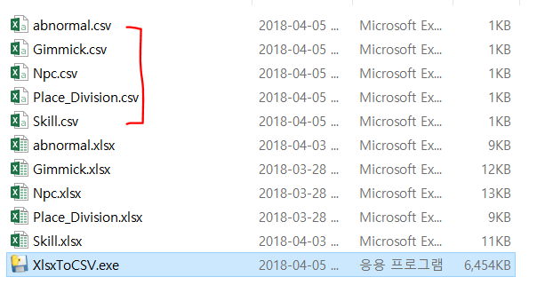

# 유니티

## Tilemap Layer
- Order in Layer 관련
    - Tilemap의 부모(Grid)를 한번 선택하면 자동으로 Hierarchiy 순서로 정렬 및 적용
    - 

# XlsxToCSV
- 작동방식 : 동일한 폴더 내의 xlsx 파일을 모두 긁어와 csv파일로 변환
- 유의할점 : 데이터 시트가 첫번째에 위치해야 함
- 사용법 : XlsxToCSV.exe 를 실행시키면 변환된 csv파일이 동일 폴더 내에 생성
- 